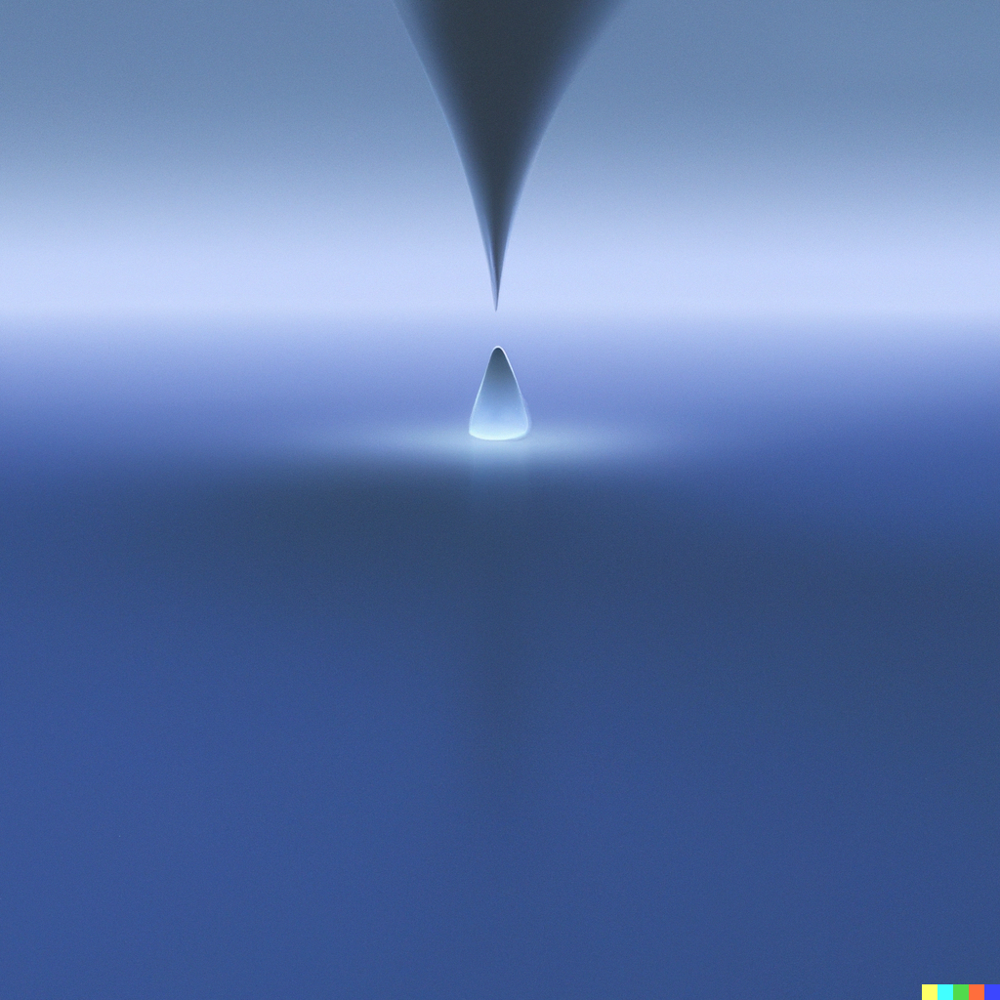

# Huh? •  

A NFT solution to mint anonymously.

## What is it?

At its core, Huh? is a minimalist, modulable, extendable solution to obfuscate the relationship between who *pays* for the mint and who actually *mints* it.

With the help of zero-knowledge proofs, you can pay from one wallet, and mint it with another that no ones knows about.

## How?

When you pay, you give a *commitment* to the smart-contract, which is simply a hash of two secret numbers **only you** should have.
You can generate the commitment and the nullifier hash through either the provided scripts or by building your own frontend.

Once you are ready to mint, you will need to first generate the proof, again with the help of the provided scripts or not. Once it's done, you can use it to mint to the recipient you specified
during the proof generation.

## Warning

This is experimental code that has **not** been audited! Total anonymity is not guaranteed, and there are always ways to link two addresses together if the user hasn't been careful beforehand.
This is why we also recommend to the developers to only allow minting *for everyone* after a certain timestamp, potentially bettering the anonymity set.

## License

[AGPL-3.0-only](https://github.com/abigger87/femplate/blob/master/LICENSE)

## Acknowledgements

- [foundry](https://github.com/foundry-rs)
- [noir](https://github.com/noir-lang/noir)
- [nplate](https://github.com/whitenois3/nplate)
- [simple_shield](https://github.com/vezenovm/simple_shield)
- The green swirling air that won't be mentionned to not get randomly OFAC'd

## Disclaimer

_These smart contracts are being provided as is. No guarantee, representation or warranty is being made, express or implied, as to the safety or correctness of the user interface or the smart contracts. They have not been audited and as such there can be no assurance they will work as intended, and users may experience delays, failures, errors, omissions, loss of transmitted information or loss of funds. The creators are not liable for any of the foregoing. Users should proceed with caution and use at their own risk._
